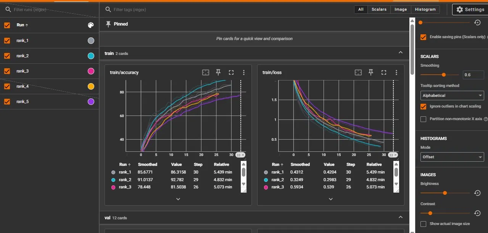
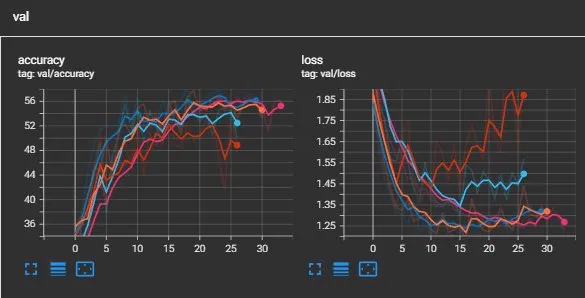
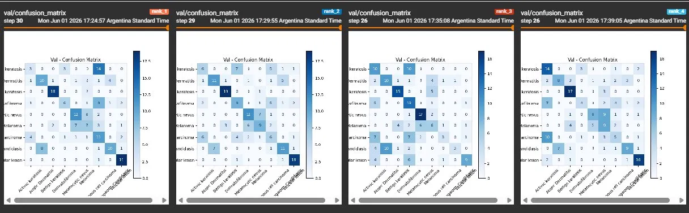

# Análisis de Búsqueda de Hiperparámetros
**Clasificación de Lesiones de Piel — MLP Classifier**  
Experimento: `Clasificador_Imagenes` | MLflow Experiment ID: 2

---

## 1. Experimento

Se realizó una búsqueda aleatoria de hiperparámetros (Random Search), utilizando una probabilidad de selección p=0.10. La búsqueda se ejecutó bajo el experimento `Clasificador_Imagenes` (ID: 2) en MLflow.

El modelo utilizado en todos los runs fue un MLP (Multilayer Perceptron) con arquitectura fija de dos capas ocultas (512 → 128 neuronas), entrenado para clasificar imágenes de lesiones de piel en 9 clases del dataset ISIC.

### 1.1 Espacio de Hiperparámetros Explorado

| Hiperparámetro | Valores explorados |
|---|---|
| input_size | 32, 64, 128 |
| batch_size | 16, 64, 128 |
| lr (learning rate) | 0.01, 0.001, 0.0001 |
| optimizer | Adam, SGD |
| dropout | 0.0, 0.1, 0.2, 0.3 |
| HorizontalFlip | 0.0, 0.5 |
| VerticalFlip | 0.0, 0.5 |
| RandomBrightnessContrast | 0.0, 0.5 |
| epochs | 200 (con early stopping, patience=10) |

---

## 2. Problema Detectado: Data Leakage en el Dataset

Durante el análisis exploratorio del dataset se detectó que 33 imágenes estaban presentes simultáneamente en el conjunto de train y en el de validación (val), lo que constituye un caso de data leakage. El data leakage se produce cuando un modelo utiliza, durante el entrenamiento, información que no estaría disponible en el momento de la predicción ([IBM](https://www.ibm.com/es-es/think/topics/data-leakage-machine-learning)).

### 2.1 Impacto en los resultados

La primera búsqueda de hiperparámetros se ejecutó con el dataset original (con duplicados), generando métricas de validación infladas artificialmente. Al evaluar modelos en imágenes que el modelo ya había visto durante el entrenamiento, el val_accuracy reportado no reflejaba la capacidad de generalización real del modelo.

La segunda búsqueda, realizada después de redistribuir correctamente las imágenes duplicadas, mostró resultados considerablemente más bajos pero más honestos:

| Experimento | Mejor val_accuracy |
|---|---|
| Con data leakage (dataset original) | 68.51% |
| Sin data leakage (dataset corregido) | 59.44% |

---

## 3. Resultados de la Búsqueda de Hiperparámetros

### 3.1 Top 10 — Dataset con leakage (primera búsqueda)

| Rank | val_acc% | lr | optimizer | dropout | batch | input | best_epoch |
|---|---|---|---|---|---|---|---|
| 1 | 68.51 | 0.0001 | Adam | 0.2 | 16 | 32 | 28 |
| 2 | 67.40 | 0.0001 | Adam | 0.0 | 16 | 32 | — |
| 3 | 65.19 | 0.001  | Adam | 0.0 | 16 | 64 | — |
| 4 | 64.64 | 0.001  | Adam | 0.1 | 128 | 32 | — |
| 5 | 63.54 | 0.0001 | Adam | 0.3 | 64 | 32 | — |
| 6 | 62.98 | 0.01   | SGD  | 0.1 | 16 | 32 | — |
| 7 | 61.88 | 0.001  | Adam | 0.0 | 16 | 32 | — |
| 8 | 61.88 | 0.01   | SGD  | 0.3 | 16 | 32 | — |
| 9 | 61.33 | 0.01   | SGD  | 0.3 | 16 | 64 | — |
| 10 | 61.33 | 0.001 | Adam | 0.2 | 64 | 32 | — |

### 3.2 Top 5 — Dataset corregido (segunda búsqueda)

| Rank | val_acc% | lr | optimizer | dropout | batch | input | best_epoch |
|---|---|---|---|---|---|---|---|
| 1 | 59.44 | 0.0001 | Adam | 0.0 | 128 | 64 | — |
| 2 | 59.44 | 0.001  | Adam | 0.3 | 128 | 64 | — |
| 3 | 58.89 | 0.0001 | Adam | 0.1 | 16  | 64 | — |
| 4 | 58.33 | 0.001  | Adam | 0.2 | 128 | 32 | — |
| 5 | 58.33 | 0.0001 | Adam | 0.0 | 64  | 32 | — |

---

## 4. Análisis de Patrones en el Top 10

Al analizar el top 10 de los 148 runs del dataset corregido, se identificaron los siguientes patrones:

- **Optimizer:** Adam domina completamente. Aparece en 8 de los 10 mejores runs. SGD solo aparece en 2 casos (ranks 6 y 10), ambos con comportamiento menos consistente.
- **Learning rate:** No hay un valor dominante claro — lr=0.0001 aparece en 5 runs y lr=0.001 en 4. Ambos funcionan bien. lr=0.01 solo aparece una vez (con SGD).
- **input_size:** A diferencia de la búsqueda con leakage, acá input_size=64 aparece en 5 de los 10 mejores y input_size=32 en 4. Input_size=128 aparece solo en 2 casos. Mayor resolución parece ayudar levemente en el dataset limpio.
- **batch_size:** Más variado que en la primera búsqueda. batch=128 aparece en 3 runs, batch=16 en 3, batch=64 en 3. No hay un valor claramente dominante.
- **dropout:** 0.0 aparece 3 veces, 0.1 dos veces, 0.2 dos veces, 0.3 una vez. No hay un valor óptimo claro, lo que sugiere que la regularización no es el factor determinante en este problema.
- **Augmentación:** HFlip=0.0, VFlip=0.0 predominan. RBContrast resultó en 0.0 en 5 runs y 0.5 en 5 runs. La augmentación no mejoró los resultados en este dataset.

## 5. Evaluación de los Top 5 Modelos (Dataset Corregido)

Se entrenaron los 5 mejores conjuntos de hiperparámetros de forma individual con el dataset corregido (sin duplicados), usando early stopping con patience=10 y hasta 200 epochs.

| Rank | best_val_acc% | lr | optimizer | dropout | batch | input | best_epoch |
|---|---|---|---|---|---|---|---|
| 2 | 58.33% | 0.0001 | Adam | 0.0 | 16 | 32 | 18 |
| 1 | 57.78% | 0.0001 | Adam | 0.2 | 16 | 32 | 19 |
| 5 | 56.67% | 0.0001 | Adam | 0.3 | 64 | 32 | 22 |
| 4 | 56.11% | 0.001  | Adam | 0.1 | 128 | 32 | 15 |
| 3 | 55.56% | 0.001  | Adam | 0.0 | 16  | 64 | 15 |

**Observación sobre las curvas de entrenamiento:** 
**Train accuracy:**
Todos los modelos suben consistentemente. Todos aprenden bien del train, con distintas velocidades según lr y batch_size.

***Val accuracy:**
Sube hasta el pico y luego cae o se estabiliza. La caída posterior al pico es la señal de overfitting, ya que el modelo empieza a memorizar train y pierde generalización.
**Val loss:**
Baja inicialmente pero después empieza a subir en varios modelos, confirmando el overfitting.

**Observación sobre las matrices de confusión:** 

Vemos que las clases con mejor clasificación son Benign keratosis y Vascular lesion. Por otro lado, Actinic keratosis se confunde con otras, y Melanoma se confunde con Melanocytic nevus.
---

## 6. Limitaciones y Conclusiones

### 6.1 Limitaciones del MLP para clasificación de imágenes

- El dataset es relativamente pequeño. Con pocos ejemplos por clase, el modelo tiende a memorizar en lugar de generalizar.
- La búsqueda no completó el 100% del espacio: la segunda corrida (dataset corregido) terminó con 148 runs por un crash de memoria/disco.

### 6.2 Conclusiones

- El mejor modelo real (sin leakage) alcanzó un val_accuracy de **59.44%**, por debajo del objetivo de 60% o más.
- La augmentación de datos no aportó mejoras.
- El data leakage infló los resultados y fue corregido redistribuyendo las imágenes.
- Los logs completos de todos los runs están disponibles en el directorio `mlruns/` (Experiment ID: 2) y pueden visualizarse.
